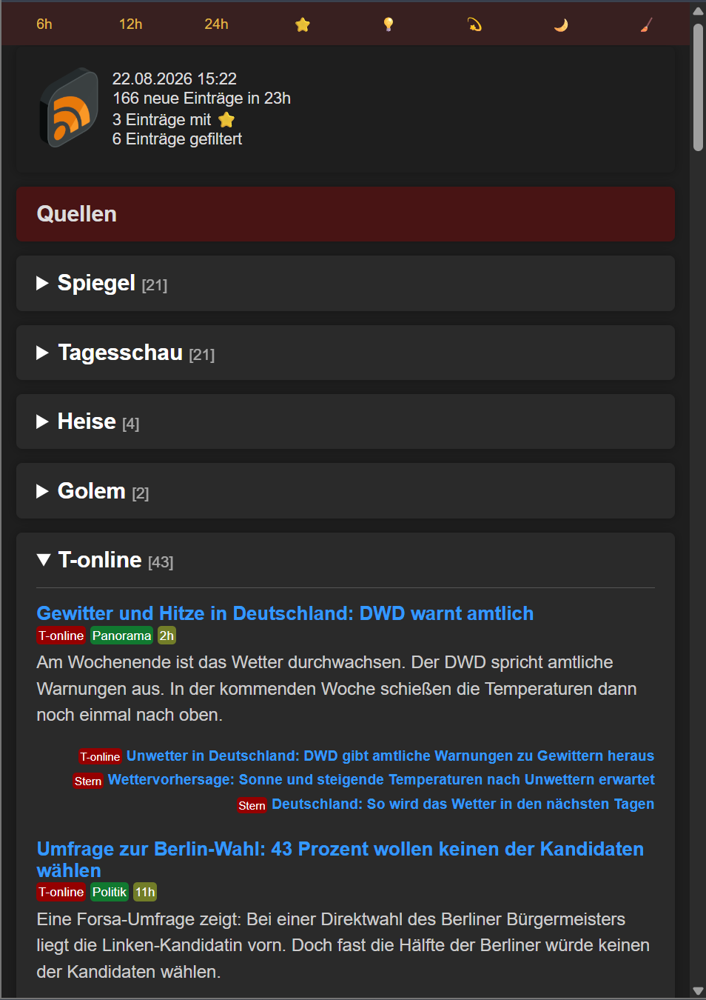

# NFM — News Feed Manager

NFM is a self-hosted, personalized RSS news reader built around semantic deduplication, user-specific filtering, and click-driven ML tagging. The app aggregates feeds from multiple sources, filters and ranks articles for a user, and can serve a web UI or scheduled email digest without requiring a database.

Built with FastAPI, designed to run comfortably on low-resource hardware (Raspberry Pi compatible).

<p align="center"></p>

## Features

- **Multi-source RSS aggregation** — fetches feeds asynchronously (bounded concurrency) from any number of configured sources
- **Semantic deduplication** — two-stage pipeline (TF-IDF pre-filter + sentence-transformer similarity) collapses near-identical stories reported by multiple outlets
- **Per-user personalization** — each user has their own feed list, blacklist/highlight keywords, and delivery channels (web and/or email)
- **ML-based interest tagging 💡** — a lightweight classifier learns from your click behavior ("liked" vs. "marked as read") and highlights new stories similar to what you've engaged with before, retraining automatically as click data accumulates
- **Paywall detection** — flags articles likely to be behind a paywall based on heuristic content scoring
- **Web UI + Email digest** — browse via a responsive web page, well suited for mobile clients or receive a scheduled HTML email digest
- **No database** — all state lives in JSON/JSONL files on disk

## Stack

- FastAPI
- Jinja2
- APScheduler
- feedparser
- scikit-learn
- sentence-transformers
- PyTorch (CPU build)
- uv for environment management

## Architecture

```
RSS feeds → async fetch → semantic dedup → personalized filtering → render (web/email) → click tracking → ML retraining
```

| Component | Responsibility |
|---|---|
| `main.py` | FastAPI app, APScheduler jobs (hourly feed refresh, daily email) |
| `main_web_eval.py` | Lightweight dev server that serves precomputed render data for fast UI iteration |
| `app/core/feedmgr.py` | `NewsFeedManager` — coordinates all configured users |
| `app/core/feedprocessor.py` | Async RSS fetching with concurrency limits |
| `app/core/dedup.py` | TF-IDF + sentence-transformer semantic deduplication |
| `app/core/ml.py` | Per-user click-based interest tagging and model retraining |
| `app/core/filter.py` | Source-specific description cleaners |
| `app/core/tools.py` | Filters (blacklist, paywall, time window), email sending, link-ID hashing |
| `app/core/render.py` | Jinja2 rendering with embedded assets for email compatibility |
| `app/conf/config.py` | Users, feeds, blacklists, highlight keywords, ML settings |

## Getting Started

### Prerequisites

- Python 3.11+
- [uv](https://docs.astral.sh/uv/) for dependency and virtual environment management

### Installation

```bash
git clone <this-repo>
cd nfm
uv sync
```

### Configuration

1. Copy the secrets template and fill in your SMTP credentials (only needed for email delivery):
2. Edit `app/conf/config.py` to define your own user(s), feed lists, blacklist/highlight keywords, and scheduling. See `config_user01` for a complete example.

### Running Locally

```bash
# Full pipeline: live RSS fetching, scheduler, ML tagging
uv run --active main.py --reload
```

Once running, open `http://localhost:8000/<uid>` (e.g. `http://localhost:8000/user01`).

### Running Tests

```bash
uv run --active pytest
```

## Docker Deployment

A production-ready Docker Compose setup with an Nginx reverse proxy is included.

```cmd
cd docker
build-amd64.cmd
docker-compose -f docker-compose.amd64.yml up -d
```

See [doc/DOCKER_DEPLOYMENT.md](doc/DOCKER_DEPLOYMENT.md) and [doc/DOCKER_QUICK_REFERENCE.md](doc/DOCKER_QUICK_REFERENCE.md) for full deployment and troubleshooting instructions.

## Key Endpoints

| Endpoint | Description |
|---|---|
| `GET /{uid}` | Web UI for the given user |
| `GET /send_email/{uid}` | Trigger an on-demand email digest |
| `GET /{uid}/clicktrack?lid=...&rating=...` | Record a click (positive/negative sample) |
| `POST /{uid}/save_negative_samples` | Bulk-record "marked as read" items as negative ML samples |

## Project Structure

``` txt
main.py                    # Production FastAPI app with scheduler
main_web_eval.py            # Dev server using precomputed render data
app/
  conf/                    # Configuration (users, feeds, ML/paywall settings)
  core/                    # Fetching, dedup, ML tagging, filtering, rendering
  web/                     # Static assets and Jinja2 templates
aux_data/                  # Stopwords used for TF-IDF pre-filtering
clicktrack/                # Per-user click history (JSONL) and trained ML models
docker/                    # Dockerfile, Compose files, build scripts
nginx/                     # Reverse proxy configuration
tests/                     # Test suite
```

## Notes

- Optimized for low-resource deployment; uses a CPU-only PyTorch build and a small (~80MB) multilingual sentence-transformer model.
- German-language focus out of the box (stopwords, default keywords, news sources), but fully configurable for other languages via `app/conf/config.py`.
- `secrets/secrets.json`, click-tracking data, and trained ML models are git-ignored and machine/user-specific — never commit real credentials.

## License

This project is distributed under the MIT License. See [LICENSE.txt](LICENSE.txt).
